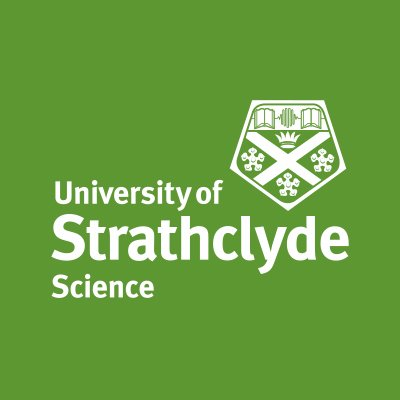
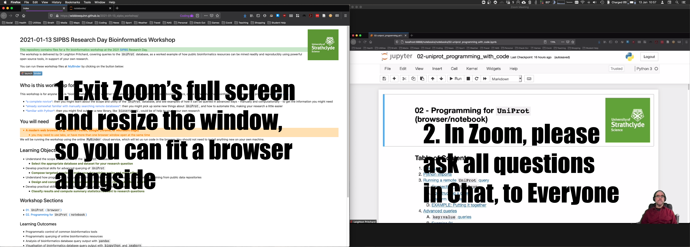

# SIPBS Research Day Bioinformatics Workshop 13th January 2021

## Introduction

Welcome to the GitHub repository for the 2021 SIPBS Research Day Bioinformatics Workshop. 

The workshop is delivered by Dr Leighton Pritchard, covering queries to the [`UniProt`](https://www.uniprot.org/) database, as a worked example of how public bioinformatics resources can be mined readily and reproducibly using powerful open source tools, in support of your own research.

You can run these workshop files at [MyBinder](https://mybinder.org/v2/gh/widdowquinn/2021-01-13_sipbs_workshop/master?filepath=index.ipynb) by clicking on the button below:

-------

<!-- TOC -->

- [SIPBS Research Day Bioinformatics Workshop 13th January 2021](#sipbs-research-day-bioinformatics-workshop-13th-january-2021)
  - [Introduction](#introduction)
  - [How are we doing this?](#how-are-we-doing-this)
  - [How do I get help?](#how-do-i-get-help)
  - [What if I miss something?](#what-if-i-miss-something)
  - [Who is this workshop for?](#who-is-this-workshop-for)
  - [You will need](#you-will-need)
  - [Learning Objectives](#learning-objectives)
  - [Workshop Sections](#workshop-sections)
    - [Learning Outcomes](#learning-outcomes)
  - [Where next?](#where-next)
  - [Where next?](#where-next-1)

<!-- /TOC -->

-------

## How are we doing this?

The workshop will be presented over Zoom, and you will be following along by working through the materials and examples in a modern browser (such as Chrome, Mozilla Firefox, or Microsoft Edge). You will need to have two windows open - this could be across two monitors, or on a single screen. You might want to use a second device, e.g. a tablet or phone, to follow the Zoom component and give you maximum screen space for your browser/coding session. On a single screen, you might arrange windows as below:

## How do I get help?

- Please ask questions in the Zoom chat (to `Everyone`) - Steven Ford will be fielding these, to help ensure smooth running of the presentation part of the workshop.

## What if I miss something?

The materials will remain available at this site, so you will be able to return to them as a reference, or to cover items you may have missed.

-------

## Who is this workshop for?

This workshop is for anyone who is "bioinformatics-curious," whether they already do some or all of their own bioinformatics, or are wondering what bioinformatics involves on a practical level. If you are…

- *a complete novice*: then you might learn about the scope and utility of the `UniProt` database, and see examples of how it can be queried in advanced ways - manually and computationally - to get the information you might need
- *already somewhat familiar with manually searching remote databases*: then you might pick up some new things about `UniProt`, and how to automate this, making your research a little easier
- *familiar with Python*: then you might find out how a new library, like [`bioservices`](https://bioservices.readthedocs.io/en/master/), could be of help to you in your own research

## You will need

- **A modern web browser (e.g. Mozilla Firefox, Google Chrome, or Microsoft Edge)**
  - you may need to use tabs, or have more than one browser window open at the same time

We will be running the workshop using the online [`MyBinder`](https://mybinder.org/) cloud service, which will let us run code in the browser. You should not need to install anything new on your own machine.

## Learning Objectives

- Understand the scope and structure of the [`UniProt`](https://www.uniprot.org/) database
  - <b>Select the appropriate database and dataset for your research question</b>
- Develop practical skills for advanced querying of `UniProt`
  - <b>Compose targeted queries to make your data mining easier and more effective</b>
- Understand how programming languages such as `Python` enable automated, large-scale data mining from public data repositories
  - <b>Design and construct short code snippets that automate remote database queries</b>
- Develop practical skills in `Python` to automate queries to remote databases
  - <b>Classify results and compute summary statistics relevant to research questions</b>

-------

## Workshop Sections

* [01.  `UniProt` (`browser`)](notebooks/01-uniprot_browser.html)
* [02.  Programming for `UniProt` (`notebook`)](notebooks/02-uniprot_programming.html)

### Learning Outcomes

* Programmatic control of common bioinformatics tools
* Programmatic querying of online bioinformatics resources
* Analysis of bioinformatics database query output with `pandas`
* Visualisation of bioinformatics database query output with `biopython` and `seaborn`
* Interpretation of bioinformatics database query output

-------

## Where next?

## Where next?

- [Ten great papers for biologists starting out in computational biology](https://widdowquinn.github.io/ten_great_papers/) - collectively, an excellent primer/jumping off point for good practice in bioinformatics and computational biology
- [The Carpentries](https://carpentries.org/) - excellent introductory courses in foundational coding and data science; <b>we hope to be running at least one of these courses online this year in SIPBS</b>
- [Bioinformatics Workbook](https://bioinformaticsworkbook.org/#gsc.tab=0) - tutorials on topics in bioinformatics
- [Bioinformatics Algorithms](https://www.bioinformaticsalgorithms.org/home) - the home site for a textbook on bioinformatics algorithms, including lectures and other materials

- [Introduction to Jupyter notebooks](https://realpython.com/jupyter-notebook-introduction/) - a good introduction to working in the Jupyter notebook system (which we're using for the workshop), and installing it on your own machine.
  - [RealPython](https://realpython.com/) - this page is part of the `RealPython` site, which is a good (but not free) resource for learning or improving your Python skills

- [rosalind.info](http://rosalind.info/problems/locations/) - interactive, self-paced bioinformatics problems
- [Advent of Code](https://adventofcode.com/) - yearly programming challenges, themed around Christmas

or send Leighton an email, for a chat.